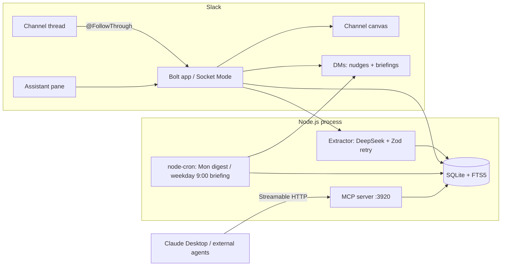

# FollowThrough — Architecture

One Node.js/TypeScript process. SQLite is the single source of truth, shared in-process by
the Bolt Slack app, the cron jobs, and the MCP server. All LLM traffic goes through one thin
OpenAI-compatible client (DeepSeek in the demo) and is never trusted raw.

## Components

| Component | Responsibility | Key file |
|---|---|---|
| Config | Env loading, verbatim var names, defaults | `src/config.ts` |
| Store | Schema (CHECK on status), decisions FTS5, commitments, users, canvas ids | `src/store/db.ts` + `src/store/*Store.ts` |
| LLM client | One `complete(system, user)` call, swappable (FakeLlm in tests) | `src/llm/client.ts` |
| Extractor | Prompt anchored to today's date → Zod parse → one retry with the error → refusal | `src/extractor/extract.ts` |
| Capture | Thread fetch, owner resolution, insert, summary card | `src/slack/capture.ts`, `src/slack/ownerResolution.ts`, `src/slack/blocks.ts` |
| Canvas register | Per-channel canvas markdown, create-once-then-edit sync | `src/slack/canvas.ts` |
| Complete | Mark-done button: status flip, nudge cancel, message update, canvas resync | `src/slack/complete.ts` |
| Chase | Nudge scheduling (`chat.scheduleMessage` into a DM), Monday digest | `src/slack/nudger.ts` |
| Briefing | Weekday 9:00 cron + on-demand; LLM focus line with static fallback | `src/slack/briefing.ts` |
| Recall | Assistant pane: FTS + optional `search.messages` context → cited answer | `src/slack/recall.ts` |
| MCP server | Read-only Streamable HTTP on `:3920`: `search_decisions`, `list_open_commitments`, `get_decision` | `src/mcp/server.ts`, `src/mcp/tools.ts` |
| Entrypoint | Boots app + MCP + crons | `src/index.ts` |

## Data model

- `decisions(id, channel_id, what, rationale, decided_by, source_permalink, created_at)`
  with an FTS5 mirror (`decisions_fts`) kept current by trigger.
- `commitments(id, channel_id, owner_user_id, task, deadline, status, source_permalink,
  nudge_scheduled_id, created_at)`; `status` CHECK-constrained to `open | done | slipped`;
  `deadline` is `YYYY-MM-DD`, `YYYY-MM-DDTHH:mm`, or NULL.
- `owner_user_id` holds a resolved Slack ID (`/^[UW][A-Z0-9]{2,}$/`) or the raw extracted
  name. Raw-name owners never get DMs; they appear only in channel-facing output.
- `nudge_scheduled_id` stores `"<dmChannelId>:<scheduledMessageId>"` so completion can call
  `chat.deleteScheduledMessage`.
- `users(user_id, last_briefed_at)` and `channel_canvases(channel_id, canvas_id)` are
  plumbing tables.

## Error-handling principles

- **Store is source of truth.** Capture commits to SQLite first; canvas sync is best-effort
  and a failure posts a warning without failing the capture.
- **LLM output is never trusted raw.** Every response is Zod-validated; on failure the
  validation error is appended and retried once; then the bot politely refuses. The briefing
  focus line degrades to a static string.
- **Nudge deletion is best-effort** — an already-sent nudge is harmless.
- **Recall search context is optional** — no user token or a search failure just means fewer
  snippets; answers still come from the decision log.
- Timestamps are UTC ISO-8601 strings; nudge/briefing clock times are workspace-local via
  the server `TZ`.
