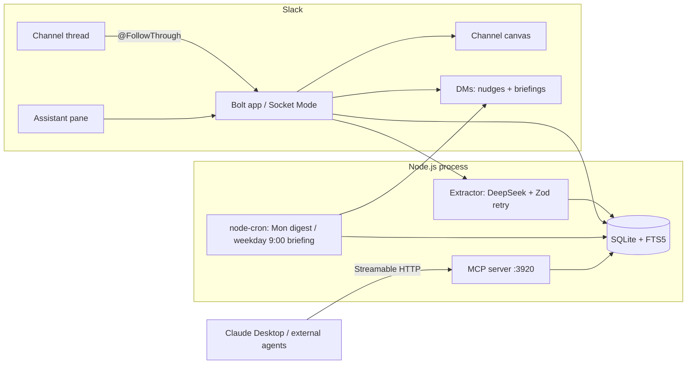

# Task 17: End-to-end run, demo script, README, architecture diagram

Global constraints: see `00-overview.md`. **Every md file ≤ 200 lines.**

**Files:**
- Create: `README.md`, `docs/architecture.md`, `docs/demo-script.md`

**Interfaces:** none — this task verifies the whole system and produces submission collateral (Devpost needs: sandbox access, <3-min video, architecture diagram, text description, track ID).

- [ ] **Step 1: Full verification**

```bash
npx tsc --noEmit        # Expected: no errors
npx vitest run          # Expected: all suites pass
set -a && source .env && set +a && npm run smoke:extractor   # Expected: All fixtures passed
```

- [ ] **Step 2: Scripted end-to-end sandbox run (doubles as video rehearsal)**

With `npm run dev` running, walk the spec's demo plan in `#proj-demo`:
1. Post a messy 4–6 message decision thread (use fixture `clear-decision-with-deadline` as the script) → reply `@FollowThrough` → summary card with Mark done button.
2. Open the channel canvas → register shows the decision + open commitment.
3. Trigger a briefing without waiting for 9:00: `npx tsx -e` one-liner calling `runDailyBriefings(db, llm, sendDm, new Date())` (copy the sendDm closure from `src/index.ts`) → briefing DM arrives.
4. Click **Mark done ✅** in the DM → message updates to "✅ Done (by @you)", canvas moves it to Done, scheduled nudge disappears from `chat.scheduledMessages.list`.
5. Assistant pane: "What did we decide about billing and why?" → cited answer with permalink.
6. Claude Desktop → Settings → Connectors → add `http://localhost:3920/mcp` → ask "search our decision log for billing" → `search_decisions` returns the record.

Fix anything that breaks before recording. Record the video against this exact script.

- [ ] **Step 3: Write `README.md`** (≤200 lines) — sections, all content real:

- **FollowThrough** — one-paragraph pitch (decisions/commitments as first-class Slack objects; capture → register → chase → complete → recall → briefing → MCP).
- **Hackathon**: track *Agent for Organizations*; qualifying capabilities used: Slack AI `Assistant` class, MCP server, Slack search API.
- **Setup**: `npm install`; `cp .env.example .env` and fill (link `slack-app-manifest.json` + steps from `docs/superpowers/plans/2026-07-06-followthrough/09-slack-setup.md`); `npm run dev`.
- **Usage**: `@FollowThrough` in a thread; assistant pane prompts; canvas register; MCP endpoint `http://localhost:3920/mcp` with the three tools.
- **Testing**: `npm test`, `npm run smoke:extractor`.
- **Architecture**: link `docs/architecture.md`.

- [ ] **Step 4: Write `docs/architecture.md`** with this mermaid diagram (export a PNG of it for Devpost):



Plus one short section per component (responsibility + key file), and the error-handling principles (store is source of truth; canvas best-effort; LLM never trusted raw).

- [ ] **Step 5: Write `docs/demo-script.md`** — the Step 2 walkthrough as a timed shot list totaling <2:45 (0:00 hook/problem, 0:20 capture, 0:50 canvas, 1:10 briefing DM, 1:30 mark done, 1:50 recall, 2:15 MCP from Claude Desktop, 2:40 close with track + ROI line).

- [ ] **Step 6: Verify md line counts and commit**

```bash
wc -l README.md docs/architecture.md docs/demo-script.md   # each must be ≤ 200
git add README.md docs/architecture.md docs/demo-script.md
git commit -m "docs: README, architecture diagram, demo script"
```

- [ ] **Step 7: Submission checklist (human)**

- [ ] Record and upload the <3-min video following `docs/demo-script.md`.
- [ ] Devpost: description (reuse README pitch), architecture diagram PNG, track ID (*Agent for Organizations*), sandbox workspace access for judges.
- [ ] Submit before **July 13, 2026, 5:00 PM PT** — aim for July 12 to leave slack.
